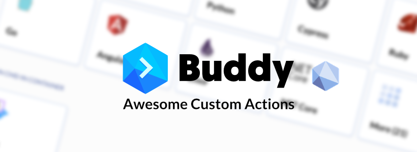

# Awesome Custom Actions for Buddy Works

## Documentation

* Official Documentation about [Custom Actions in Buddy](https://buddy.works/docs/pipelines/custom-actions).
* [How it works](https://buddy.works/blog/introducing-custom-actions)

## List of Custom Actions:

### No deploy on Friday by Palmiak

This action prevents Friday deployments.

Learn more about creating actions in this article.

[Link to Repo](https://github.com/palmiak/custom-actions-article/tree/master/.buddy/actions/no_deploys_on_friday)

---

### API Parser by Palmiak

This action parses an API request using `jq` and passes the results further.

Learn more about creating actions in this [article](https://maciekpalmowski.dev/creating-custom-actions-in-buddy).

[Link To Repo](https://github.com/palmiak/custom-actions-article/tree/master/.buddy/actions/api_testing)

---

### Change_Rate by cZuLi

This action track the exchange rate. We use the floatrates.com API.
We parses an API request using `jq`

[Link to Repo](https://github.com/czuli/awesome-custom-actions-buddy/tree/main/.buddy/actions/change_rate)

---
